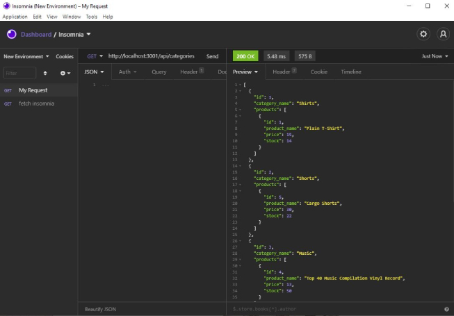

    
  
  # shopBack: an e-Commerce backend server
  ## UA Web Coding Bootcamp Challenge - Week 13 
  
  ## Description  
  This project implements the back-end of an e-commerce retail site. It interacts with a MySQL price and inventory database through the node.js Sequelize ORM (Object Relation Map) using an express.js API. There is no front-end. [Insomnia](https://insomnia.rest/) or another similar desktop applications can be used for demonstration and testing.  

  ### Link to YouTube Walkthrough
  [ShopBack demo part 1](https://www.youtube.com/watch?v=mGzU7Kxb4Gw)   
  [ShopBack demo part 2](https://www.youtube.com/watch?v=t8qZuBqBj2E)  
  
  
  ## Table of Contents  
  * [Installation](#Installation)  
  * [Usage](#Usage) 
  * [User_Story](#User_Story)  
  * [User_Requirements](#User_Requirements)  
  * [Questions](#Questions)    
  * [License](#License)
  ## Installation  
  This project requires node.js. To install: 
  
1. NAVIGATE TO THE DIRECTORY where you will be using this software, initialize by typing "npm init" into the terminal in the root directory of your project, and installing the following packages:   

    * [express.js](https://expressjs.com/)    
    * [MySQL2](https://www.npmjs.com/package/mysql2)    
    * [dotenv](https://www.npmjs.com/package/dotenv)    
    * [sequelize](https://www.npmjs.com/package/sequelize)

  2. OPEN THE .env FILE AND SET ENVIRONMENT VARIABLES:  
      * DB_NAME='ecommerce_db'  
      * DB_USER= <your MySQL username>  
      * DB_PW= <your MySQL password> 

  3.  INITIALIZE THE DATABASE  
      Start MySql  ("mysql -u "username" -p) with your username and password
      Create the database: "source ./db/schema.sql"
      exit SQL

  4.  SEED THE DATABASE  
      On the command line, type "npm run seed"
    
  ## Usage  
  * To start the server: 
    type "npm start" on the terminal command line.   
  * To interface with the server:  
    Start a desktop app such as [Insomnia](https://insomnia.rest/) and use the API methods it provides with localhost:3001.

  ## User_Story 
  AS A manager at an internet retail company  
  * I WANT a back end for my e-commerce website that uses the latest technologies  
  * SO THAT my company can compete with other e-commerce companies
  ## User_Requirements
  GIVEN a functional Express.js API  
  * WHEN I add my database name, MySQL username, and MySQL password to an environment variable file  
    THEN I am able to connect to a database using Sequelize
  * WHEN I enter schema and seed commands  
    THEN a development database is created and is seeded with test data  
  * WHEN I enter the command to invoke the application  
    THEN my server is started and the Sequelize models are synced to the MySQL database  
  * WHEN I open API GET routes in Insomnia Core for categories, products, or tags  
    THEN the data for each of these routes is displayed in a formatted JSON  
  * WHEN I test API POST, PUT, and DELETE routes in Insomnia Core  
    THEN I am able to successfully create, update, and delete data in my database  

  

   
  ## Questions
  For more information, contact  
  * [vloebel on GitHub](https://github.com/vloebel)  
  * [VickyLoebel@gmail.com](mailto:VickyLoebel@gmail.com)
  ## License
  This software is distrubted without warranty under the MIT license agreement. To view terms and conditions, visit the [MIT License website](https://opensource.org/licenses/MIT).
      
